<!-- ─────────────────────────────────────────────────────────────
     profile readme · github.com/KnockOutEZ
     every panel is a hand-built svg in /assets (light + dark),
     so nothing renders broken. the contribution graph is a
     third-party widget. telemetry-*.svg + projects-*.svg (counts,
     activity line, language bars, star counts) are regenerated
     from live github data daily by .github/workflows/telemetry.yml
     — never edit those by hand.
────────────────────────────────────────────────────────────── -->

<picture>
  <source media="(prefers-color-scheme: dark)" srcset="assets/header-dark.svg">
  <source media="(prefers-color-scheme: light)" srcset="assets/header-light.svg">
  
</picture>

  
  
  
  

<picture>
  <source media="(prefers-color-scheme: dark)" srcset="assets/whoami-dark.svg">
  <source media="(prefers-color-scheme: light)" srcset="assets/whoami-light.svg">
  
</picture>

<picture>
  <source media="(prefers-color-scheme: dark)" srcset="assets/ecosystem-dark.svg">
  <source media="(prefers-color-scheme: light)" srcset="assets/ecosystem-light.svg">
  
</picture>

<picture>
  <source media="(prefers-color-scheme: dark)" srcset="assets/projects-dark.svg">
  <source media="(prefers-color-scheme: light)" srcset="assets/projects-light.svg">
  
</picture>

  
    <a href="https://github.com/KnockOutEZ/wigolo">wigolo</a> ·
    <a href="https://github.com/KnockOutEZ/diffdeck">diffdeck</a> ·
    <a href="https://github.com/nexentra/aesir">aesir</a> ·
    <a href="https://github.com/deepnoodle-ai/risor">risor</a>
  

<picture>
  <source media="(prefers-color-scheme: dark)" srcset="assets/telemetry-dark.svg">
  <source media="(prefers-color-scheme: light)" srcset="assets/telemetry-light.svg">
  
</picture>

<picture>
  <source media="(prefers-color-scheme: dark)" srcset="https://github-readme-activity-graph.vercel.app/graph?username=KnockOutEZ&hide_border=true&radius=0&area=true&custom_title=CONTRIBUTION%20TELEMETRY&bg_color=00000000&color=8b949e&line=e6edf3&point=e6edf3&area_color=e6edf3">
  <source media="(prefers-color-scheme: light)" srcset="https://github-readme-activity-graph.vercel.app/graph?username=KnockOutEZ&hide_border=true&radius=0&area=true&custom_title=CONTRIBUTION%20TELEMETRY&bg_color=00000000&color=57606a&line=000000&point=000000&area_color=000000">
  
</picture>

<picture>
  <source media="(prefers-color-scheme: dark)" srcset="assets/route-dark.svg">
  <source media="(prefers-color-scheme: light)" srcset="assets/route-light.svg">
  
</picture>

<picture>
  <source media="(prefers-color-scheme: dark)" srcset="assets/stack-dark.svg">
  <source media="(prefers-color-scheme: light)" srcset="assets/stack-light.svg">
  
</picture>

<picture>
  <source media="(prefers-color-scheme: dark)" srcset="assets/footer-dark.svg">
  <source media="(prefers-color-scheme: light)" srcset="assets/footer-light.svg">
  
</picture>

